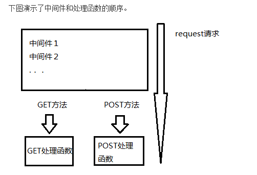

####代码案例版本对应关系

注：其他测试的版本与下一致
1. Appv1---基础以及添加get/post的不同处理方式
2. Appv2---添加route路由处理
3. Appv3---添加泛式route路由处理
4. Appv4---加上param.js中间件和query.js处理.让框架有了req.params和req.query属性.只适用于GET请求
5. 
5. 

#####框架构思
我们这边使用的是中间件的形式，来为框架添加功能，这些中间件是在执行主业务逻辑之前执行的，且这些中间件自身之间也是有顺序的。web服务器的request事件的触发，表示有客户来访问我们的服务器资源。而且我们的服务器主逻辑，就是为了响应request事件的。伪代码的表示如下：
```javascript
function handler() {
    //中间件按照顺序逐个执行
    middleWare1();
    middleWare2();
    ...
    主业务逻辑处理
}
server.on('request', handler);
```


#####怎样保证中间件的先后顺序执行
如果想要中间件的顺序执行，关靠数组的执行顺序是达不到的，因为js会牵扯到异步执行和延迟执行（setTimeout）的情况。这些情况下，我们可以通过以下方式保证它的顺序执行。
即我们给中间件一个next函数，当执行next函数的时候，其实表示中间件自身是已经被执行完成了的（保证自己要做的一切都搞定了才放手），才把权力交棒给下一个中间件。这么说来，只要中间件自身内部不调用next函数，那下一个中间件就不会被执行。权力牢牢掌握在自己手里。

####代码执行原理
假设该文件名为app.js
```javascript
var App = require('../../').App,
    app = new App(),
    middle01 = require('./middle01'),
    middle02 = require('./middle02');

app.use(middle01);
app.use(middle02);
app.listen(process.env.PORT);//如此监听的话就可以在使用node执行nodejs程序时，指定端口号
```

原理说明：

1. 当我们执行node app.js时候，它会先new App()，即启动一个应用程序，这个时候应用程序使用server.on('request', handler)。接下来执行use，即将所有用到的中间件都放入到middleWareList数组中。之后app.listen()对应端口。
2. 此时，当客户端发送一个请求过来，服务端监听到request请求，便会执行handler函数。该函数会默认执行第一个中间件（可是一般而言，每个中间件都会用next()将执行权限往下传递），执行完，其内部的next便会继续执行第二个，...。最终将所有的中间件（即middleWareList数组中所有元素）都执行完毕。

####中间件和处理函数的顺序




####路由的简单原理
 1. 最开始，我们是按照get或post的不同发送方式来区分处理，如下：
 ```javacript
app.get(function(req, res) {
...
});

app.post(function(req, res) {
...
});
 ```
 
 2. 之后，我们还可以在之前基础上，针对同一个get方式，可以按照route路由划分。我们可以用两个对象route_get_handles和route_post_handles，以key-value形式表示。
  如下：
 ```javascript
app.get('/about', function(req, res) {

});
 ```
  
 3. 泛式路由，实现如下两个泛式路由：
/doc/:id：符合这个泛式的url可以是：/doc/id0001
/doc/title/*：符合这个泛式的url可以是：/doc/title/abcd 或 /doc/title

实现上述的原理是：通过泛式规则转换为正则表达式，加以判断即可

####GET请求
 
 req.params
 ```javascript
//http://localhost:3000/about/zhangsan/dfsdf/78测试url，name＝zhangsan,age=78
app.get('/about/:name/*/:age', function(req, res) {
    res.end('My name is ' + req.params.name + '; my age is ' + req.params.age);
});
 ```

 req.query
 ```javascript
//测试的例子：http://localhost:3000/myname?name="zhangsan"&age=24
app.get('/myname', function(req, res) {
    res.end('My name is ' + req.query.name + '; age is ' + req.query.age);
});
 ```

####POST请求

1. req.body
因为get请求无法传递大数据量的请求参数，所以有了post请求方法。通过该请求方法的处理，我们便可以通过req.body获取传递过来的参数。

原理：我们通过body_data来存储post方法请求的body体数据，通过监听req.on('data', callback)，可以拿到体数据，callback可能会被调用多次，因为数据可能会很大，所以每一次得到的chunk数据都会被累加到body_data中，当req.on('end', callback)的回调函数被调用时，就表示已经读取完毕了。这是的body_data便是完整的body体数据。且将body_data挂载到req.body上。
```javascript
app.post('/post', function(req, res) {
    var body_data = '';
    req.on('data', function(chunk) {
        body_data += chunk;
    });
    req.on('end', function(req, res) {
        console.log('body体数据为：' + body_data.toString());
        req.body = qs.parse(body_data);
    });
});
```

2. 针对enctype='multipart/form-data'[也可参见对express中间件multipart.js的分析]

通过程序：node nodeframework/example/post/multipart-test.js
url:http://localhost:3000/multipart-file.html

[postjs.md](./postjs.md "关于postjs插件的详细解释")

####response响应渲染
我们实现的基本响应渲染功能，包括以下几个：
1. 页面跳转 redirect (lib/redirect.js).原理(设置头信息即可)：
```javascript
res.writeHead(302, {
    Location: location(url)
});
```

2. 文本 text (lib/text.js)
3. 静态页 static
4. 下载 download
<br>原理：通过设置response信息头即可做到。设置三个属性：
<br>Content-disposition：下载的附件文件名称
<br>Content-Type：下载文件的类型
<br>Content-Length: 下载文件的大小
```javascript
res.writeHead(200, {
    //设置下载文件名称
    'Content-disposition': 'attachment; filename=' + fileName
    //保证是二进制类型，这样浏览器可用下载方式
    'Content-Type': 'application/octet-stream',
    //设置buf大小
    'Content-Length': buf.length
});
```

5. 动态页 view


